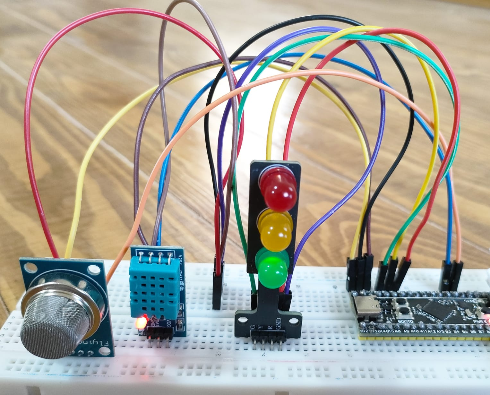

# Gas & Climate Monitoring System (STM32F4 | DHT11 + MQ135)

A bare-metal ARM assembly project for an STM32F4 board that monitors **temperature, humidity, and air quality**, then drives a 3‑color traffic-light LED module to show the worst-case condition at a glance.



## Overview

Two sensors are read every cycle:

- **DHT11** – temperature + humidity (digital, single-wire protocol)
- **MQ135** – air quality / gas concentration (analog, read via ADC)

Each sensor is independently classified into one of three severity levels — **Safe**, **Moderate**, **Severe** — and the system reports whichever is worse:

```
final_severity = MAX(dht_severity, gas_severity)
```

That combined severity is the only thing the LEDs ever show — green = safe, yellow = moderate, red = severe.

## Hardware

| Component | Role |
|---|---|
| STM32F4 dev board | Main controller (16 MHz core clock used by the timing code) |
| MQ135 | Gas/air-quality sensor, analog output |
| DHT11 | Temperature & humidity sensor |
| 3-color LED traffic-light module | Status indicator (Red / Yellow / Green) |
| Breadboard + jumper wires | Connections |

## Wiring / Connections

| Signal | MCU Pin | Notes |
|---|---|---|
| MQ135 analog out (AO) | **PA0** | ADC1, Channel 0 |
| MQ135 VCC | 5V | Heater element needs 5V per typical module |
| MQ135 GND | GND | |
| DHT11 data | **PA1** | Open-drain output / input, internal pull-up enabled in firmware |
| DHT11 VCC | 3.3V or 5V (per module spec) | |
| DHT11 GND | GND | |
| Red LED | **PB0** | Severe |
| Yellow LED | **PB1** | Moderate |
| Green LED | **PB2** | Safe |
| LED module GND | GND | |

The photo above shows the physical breadboard layout: MQ135 sensor on the far left, the DHT11 module next to it, the 3‑color traffic-light LED in the middle, and the STM32F4 board on the right with jumpers running to PA0/PA1 and PB0–PB2.

> DHT11's data line is single-wire and bidirectional — the firmware switches PA1 between output and input as needed, so it only needs one signal wire plus power and ground.

## How It Works

### 1. Initialization
- Enables clocks for GPIOA, GPIOB, TIM2, and ADC1.
- Configures PA0 as analog input (for the ADC) and PA1 as open-drain output with pull-up (for DHT11).
- Configures PB0/PB1/PB2 as push-pull outputs for the LEDs, all off initially.
- Starts **TIM2** as a free-running 1 MHz (1 µs resolution) counter — used for all delays and DHT11 protocol timing.
- Configures **ADC1** on channel 0 in continuous conversion mode with a long (480-cycle) sample time, appropriate for a slow analog sensor like the MQ135.

### 2. DHT11 Read (`DHT11_Read`)
Follows the standard DHT11 single-wire protocol:
1. Host pulls the line low for 18 ms, then releases it high for 40 µs.
2. Waits for the sensor's acknowledge sequence (low → high → low).
3. Reads 40 bits (5 bytes): humidity integer, humidity decimal, temperature integer, temperature decimal, checksum — each bit decoded by timing how long the line stays high.
4. Verifies the checksum; only on success does it mark `dht_valid = 1` and store the decoded values. If a read fails (timeout or bad checksum), the previous severity reading is kept.

### 3. Temperature & Humidity Severity (`Evaluate_DHT_Severity`)
Each value is checked independently against thresholds, and the **worse of the two wins**:

| Temperature | Severity |
|---|---|
| > 35 °C or < 10 °C | Severe |
| 28–35 °C or 10–18 °C | Moderate |
| 18–28 °C | Safe |

| Humidity | Severity |
|---|---|
| > 75% or < 20% | Severe |
| 60–75% or 20–30% | Moderate |
| 30–60% | Safe |

### 4. Gas Read & Hysteresis (`Read_Gas_Sensor`)
- Takes 8 consecutive ADC samples and averages them (sum >> 3) to smooth out noise.
- Applies a **hysteresis state machine** instead of simple thresholds, so the reading doesn't flicker rapidly near a boundary:

| Average ADC reading | Behavior |
|---|---|
| ≥ 2100 | **Severe** instantly, clears any pending yellow hold timer |
| 900 – 2099 | **Moderate**, and (re)loads a "yellow hold" timer (`YELLOW_HOLD = 3000` cycles) |
| 800 – 899 | Hysteresis gap — stays in whatever state it was already in (prevents bouncing between Safe/Moderate at the edge) |
| < 800 | **Safe**, unless the yellow hold timer is still counting down, in which case it keeps showing yellow a bit longer before dropping to green |

### 5. Combine & Display
- `final_severity = MAX(dht_severity, gas_severity)`.
- `Update_LEDs` atomically turns off all three LEDs (via `BSRR`) then turns on exactly the one matching `final_severity`: Green = Safe, Yellow = Moderate, Red = Severe.

### 6. Loop Timing
After updating the LEDs, the firmware waits 2 seconds (`READING_DELAY`, via the TIM2-based `Delay_us`) before starting the next full sensor cycle.

## Repository Structure

```
GasMonitoringSystem/
├── GasMonitoringSystem.s          # Main assembly source (this file)
├── GasMonitoringSystem.uvprojx    # Keil µVision5 project
├── GasMonitoringSystem.uvoptx     # Keil project options
├── GasMonitoringConncetions.jpeg  # Wiring/setup photo
├── .gitignore
└── README.md
```

## Building & Flashing

1. Open `GasMonitoringSystem.uvprojx` in **Keil µVision5**.
2. Select your STM32F4 target/device in the project options if not already set.
3. Build the project (F7).
4. Flash to the board over ST-Link (or your board's bootloader/USB-DFU method).
5. Power the circuit per the wiring table above and watch the LED respond to temperature, humidity, and air-quality changes.
